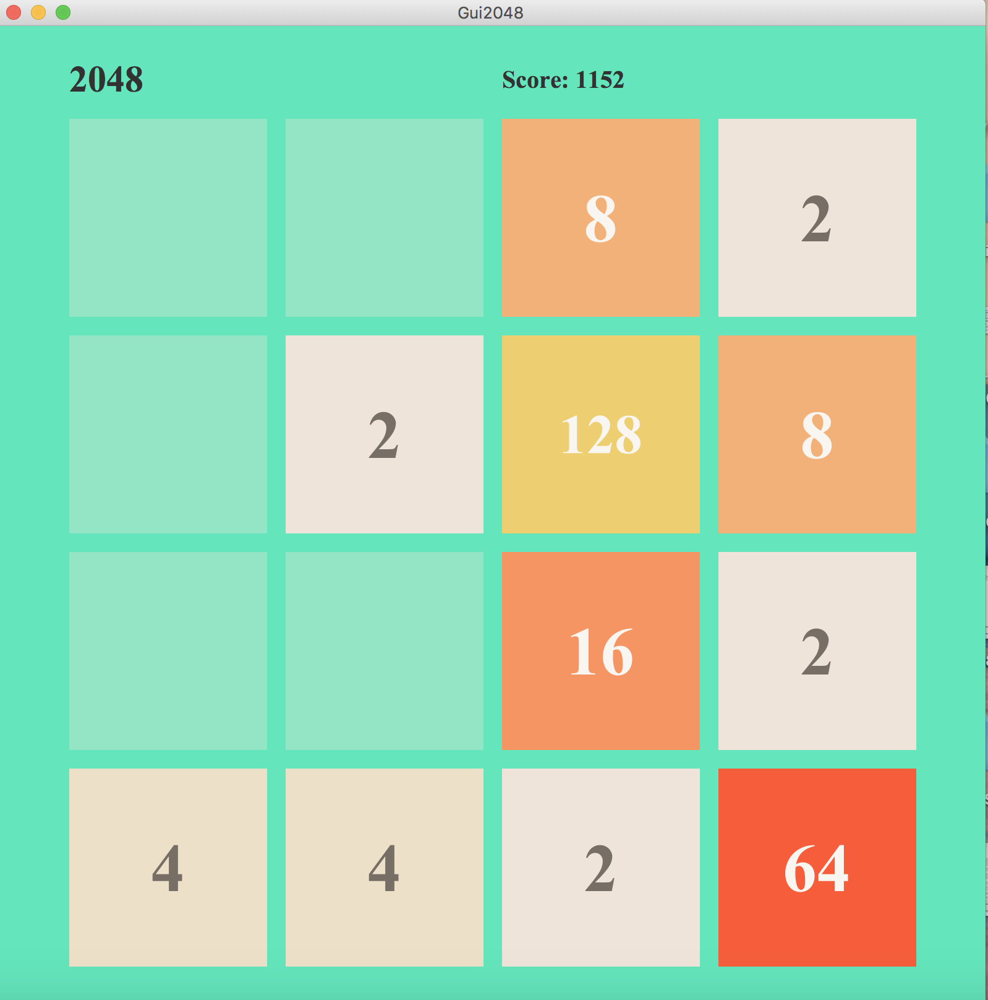

# 2048 Game
A Java Project that I created that lets a user play the popular game 2048!
UCSD CSE 8B Programming Project

## How to run the application
- Install JDK 1.8.0_131
- Ensure you have the JavaFX SDK

Use the command `javac Gui2048.java`